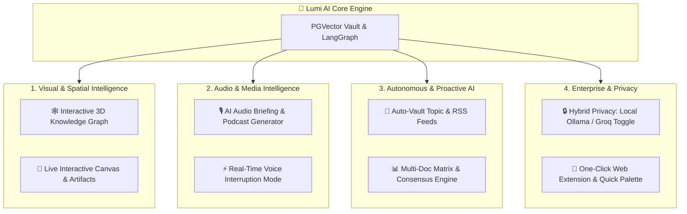

# 🚀 Lumi AI — Next-Gen "Out-of-the-Box" Feature Proposals

To make **Lumi AI** stand out from existing AI assistants and Second Brain platforms (competing with *NotebookLM*, *Perplexity*, *Notion AI*, and *Claude Artifacts*), here are 8 high-impact, futuristic feature additions organized by feasibility and technical architecture.

---

## 💡 Top 8 Standout Features for Lumi AI

---

### 1. 🕸️ Interactive 3D Knowledge Graph & Mind Map
- **Concept**: Transform flat documents into an interactive **3D force-directed node graph** (using Three.js / `force-graph`).
- **How it works**:
  - Documents, web URLs, and chat topics become glowing nodes.
  - Edges connect items based on **PGVector cosine similarity** (e.g. connecting a PDF on "FastAPI" to a chat thread on "Python Backend").
  - Users can click any node to expand related concepts or trigger a multi-document synthesis query.
- **Why it stands out**: Gives users a literal visual representation of their "Second Brain" connected memory like Obsidian / Roam Research, but AI-powered.

---

### 2. 🎨 Live Interactive Canvas & Artifacts (Split-Screen Workspace)
- **Concept**: A dynamic side-by-side workspace next to the chat window (like Claude Artifacts / ChatGPT Canvas).
- **Capabilities**:
  - Live rendering of HTML/CSS code, Mermaid.js flowcharts, interactive SVG diagrams, markdown documentation, and Python/JS code snippets.
  - Live edit mode where users can highlight text on the canvas and ask Lumi to modify, rewrite, or expand specific sections without affecting the rest of the document.
- **Why it stands out**: Turns Lumi AI from a mere chatbot into an active co-creation studio.

---

### 3. 🎙️ AI Audio Briefings & "Podcast Mode" (NotebookLM Style)
- **Concept**: Convert Knowledge Vault documents or thread summaries into a dynamic **audio overview** or 2-host conversational podcast episode.
- **Implementation**:
  - Use LangGraph to structure a script with Host A (inquiring listener) and Host B (domain expert).
  - Stream synthesized MP3 audio via multi-voice TTS (e.g. gTTS or ElevenLabs integration).
- **Why it stands out**: Enables hands-free passive learning for students, researchers, and executives on the go.

---

### 4. 📊 Multi-Document Synthesis & Consensus Matrix
- **Concept**: Select 2 to 5 Vault documents (e.g., Q1 vs Q2 report, or 3 research papers) and run automated multi-perspective analysis.
- **Features**:
  - **Consensus & Contradictions Detector**: Highlights where documents agree or conflict.
  - **Auto Comparison Matrix**: Generates a dynamic comparison table comparing methodologies, metrics, or key takeaways.
  - **Delta Summary**: Identifies what changed between document versions.
- **Why it stands out**: Saves hours of manual reading when digesting dense technical or business documents.

---

### 5. 📡 Autonomous "Auto-Brain" Topic Monitor & Feeds
- **Concept**: Background agent that monitors specific web URLs, RSS feeds, or tech topics (e.g. "FastAPI updates", "AI paper releases").
- **Implementation**:
  - Scheduled FastAPI background task periodically fetches news via Tavily / BeautifulSoup.
  - Automatically summarizes updates, generates embeddings, and inserts relevant news into the user's PGVector Vault.
  - Sends a daily email/notification digest: *"Lumi AI ingested 3 new updates into your Knowledge Vault today."*
- **Why it stands out**: Makes your Second Brain proactive instead of purely reactive.

---

### 6. 🔒 Hybrid Privacy Mode: Cloud vs. Local LLM Toggle
- **Concept**: 1-click toggle between **Cloud LLM (Groq Llama-3.3 70B)** for maximum power and **Local LLM (Ollama / Llama-3.2 local)** for 100% offline privacy.
- **Implementation**:
  - Store local embeddings via `sentence-transformers` and run local queries when Privacy Mode is engaged.
  - Zero sensitive data leaves the user's machine.
- **Why it stands out**: Solves enterprise compliance and privacy concerns for sensitive notes, financial data, or confidential codebases.

---

### 7. ⚡ Universal Command Palette (`Ctrl + K`) & Quick Actions
- **Concept**: Instant global search and action bar anywhere in the app.
- **Commands**:
  - `Ctrl + K` -> `/vault-search [query]`
  - `Ctrl + K` -> `/summarize-pdf [file]`
  - `Ctrl + K` -> `/voice-memo` (instant dictation to note)
  - `Ctrl + K` -> `/toggle-theme`
- **Why it stands out**: Provides supercharged keyboard-first productivity for power users.

---

### 8. 📎 One-Click Web Extension & Smart Clipboard Capture
- **Concept**: Lightweight Chrome / Edge extension or desktop clipboard watcher.
- **Action**: Highlight text or click "Add to Lumi Vault" on any web page -> automatically sends title, URL, clean markdown, and vector embeddings straight into the Neon PostgreSQL vault.
- **Why it stands out**: Eliminates manual saving, downloading, and uploading steps.

---

## 🛠️ Recommended Phase 1 Implementation Priority

| Feature | Effort | Impact | Recommended Stack |
| :--- | :--- | :--- | :--- |
| **1. Universal Command Palette (`Ctrl+K`)** | ⚡ Low (1-2 days) | 🔥 High | Angular CDK overlay / Command K component |
| **2. Interactive Live Canvas & Artifacts** | 🛠️ Medium (3-4 days) | 🔥 High | Angular split-screen + Prism.js + Mermaid.js |
| **3. Multi-Doc Matrix & Consensus Engine** | 🛠️ Medium (2-3 days) | 🔥 High | LangGraph prompt routing + Markdown tables |
| **4. 3D Knowledge Graph** | 🚀 High (5-7 days) | 🌟 Game Changer | Three.js + `3d-force-graph` + PGVector similarity endpoints |
| **5. AI Podcast / Audio Overview** | 🛠️ Medium (3-4 days) | 🌟 Game Changer | LangGraph script generator + gTTS multi-voice audio stream |
